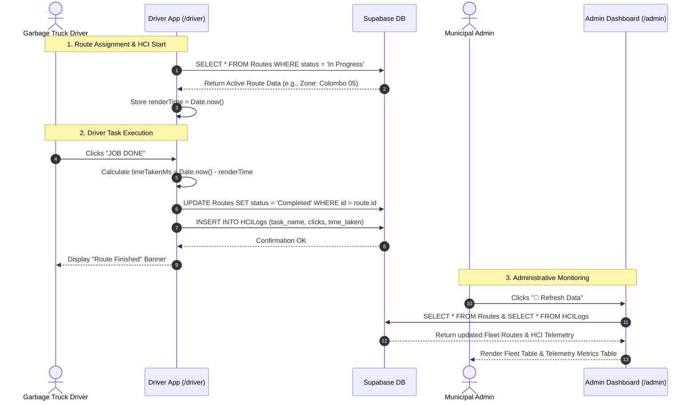
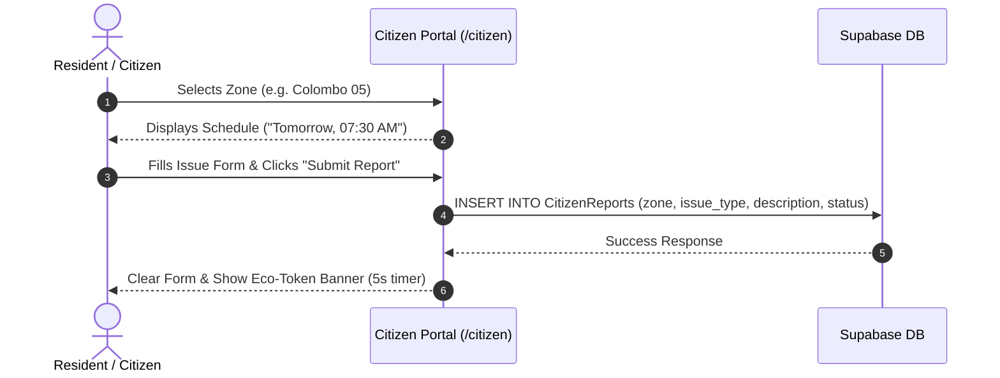

# 📄 System Requirements Specification (SRS) — EcoRoute

**Project Name:** EcoRoute — Smart Waste Management & Garbage Routing System  
**Version:** 1.0.0 (As-Built Implementation Audit)  
**Date:** August 18, 2026  
**Document Purpose:** Thesis implementation specification detailing functional, non-functional, and workflow requirements derived strictly from verified codebase features.

---

## 1. 👥 Stakeholder Analysis & System Responsibilities

| Stakeholder Role | Primary Interface | Responsibilities & System Interactions | Implementation Reference |
| :--- | :--- | :--- | :--- |
| **Municipal Administrator** | Admin Dispatch Center (`/admin`) | Monitors live municipal garbage truck route statuses; tracks SQA usability telemetry data (`HCILogs`); manually triggers data syncs. | [`src/app/admin/page.jsx`](file:///f:/PROJECT/ecoroute/src/app/admin/page.jsx#L7) |
| **Garbage Truck Driver** | Driver Terminal (`/driver`) | Views active route assignment; logs completed route pickups ("JOB DONE"); triggers HCI latency tracking; reports road blockages. | [`src/app/driver/page.jsx`](file:///f:/PROJECT/ecoroute/src/app/driver/page.jsx#L7) |
| **Citizen (Resident)** | Citizen Portal (`/citizen`) | Selects residential zone to inspect waste collection schedules; submits missed pickup or waste overflow reports; reads waste segregation guidelines. | [`src/app/citizen/page.jsx`](file:///f:/PROJECT/ecoroute/src/app/citizen/page.jsx#L7) |
| **Database System (Supabase)** | Cloud Backend | Persists active routes (`Routes`), HCI performance metrics (`HCILogs`), and public issue reports (`CitizenReports`). | [`src/lib/supabase.js`](file:///f:/PROJECT/ecoroute/src/lib/supabase.js#L10) |

---

## 2. ⚙️ Functional Requirements

### 2.1 Navigation & Central Hub
* **FR-HUB-01**: The system shall provide a centralized landing hub at `/` with links to the Admin, Driver, and Citizen portals.
  * *File Reference:* [`src/app/page.js`](file:///f:/PROJECT/ecoroute/src/app/page.js#L5)
* **FR-HUB-02**: The central hub shall display quick summary statistics for active daily routes (24) and completed pickups (1,204).
  * *File Reference:* [`src/app/page.js`](file:///f:/PROJECT/ecoroute/src/app/page.js#L18-L35)

### 2.2 Admin Dispatch Center
* **FR-ADM-01**: The system shall fetch and display all assigned routes from the `Routes` table in Supabase, showing Route ID, Driver Name, Assigned Zone, and Current Status (`Completed` vs `In Progress` / `Pending`).
  * *File Reference:* [`src/app/admin/page.jsx`](file:///f:/PROJECT/ecoroute/src/app/admin/page.jsx#L16-L21,L59-L97)
* **FR-ADM-02**: The system shall fetch and display SQA usability telemetry logs from the `HCILogs` table in Supabase, ordered by log ID descending, showing Log ID, Task Name, Clicks Registered, and Time Taken (ms).
  * *File Reference:* [`src/app/admin/page.jsx`](file:///f:/PROJECT/ecoroute/src/app/admin/page.jsx#L24-L29,L99-L133)
* **FR-ADM-03**: The admin portal shall provide a "🔄 Refresh Data" button that re-executes Supabase queries and updates state.
  * *File Reference:* [`src/app/admin/page.jsx`](file:///f:/PROJECT/ecoroute/src/app/admin/page.jsx#L49-L56)

### 2.3 Driver App & Field Operations
* **FR-DRV-01**: The driver app shall query Supabase for the active route where `status = 'In Progress'`.
  * *File Reference:* [`src/app/driver/page.jsx`](file:///f:/PROJECT/ecoroute/src/app/driver/page.jsx#L16-L21)
* **FR-DRV-02**: The system shall display the assigned zone and driver name in a touch-optimized UI.
  * *File Reference:* [`src/app/driver/page.jsx`](file:///f:/PROJECT/ecoroute/src/app/driver/page.jsx#L82-L93)
* **FR-DRV-03**: The driver app shall provide a primary "✅ JOB DONE" action button. Clicking this button shall:
  1. Update the matching `Routes` row `status` to `'Completed'`.
  2. Compute task duration `timeTakenMs = Date.now() - renderTime`.
  3. Insert an entry into `HCILogs` containing `{ task_name: 'Mark Route Completed', clicks: 1, time_taken: timeTakenMs }`.
  4. Display a success banner ("✅ Route marked as completed! Metrics logged.").
  * *File Reference:* [`src/app/driver/page.jsx`](file:///f:/PROJECT/ecoroute/src/app/driver/page.jsx#L34-L65,L105-L110)
* **FR-DRV-04**: The driver app shall render an empty state card ("No Active Routes") when no `In Progress` routes are returned.
  * *File Reference:* [`src/app/driver/page.jsx`](file:///f:/PROJECT/ecoroute/src/app/driver/page.jsx#L120-L126)

### 2.4 Citizen Portal
* **FR-CTZ-01**: The citizen portal shall allow residents to select a residential zone (Colombo 03, Colombo 04, Colombo 05, Colombo 07) to view pickup schedule info.
  * *File Reference:* [`src/app/citizen/page.jsx`](file:///f:/PROJECT/ecoroute/src/app/citizen/page.jsx#L65-L82)
* **FR-CTZ-02**: The citizen portal shall provide an issue submission form allowing users to select an issue type (*Missed Garbage Pickup*, *Overflowing Public Bin*, *Illegal Dumping Spotted*, *Request E-Waste Collection*), enter a text description, and submit.
  * *File Reference:* [`src/app/citizen/page.jsx`](file:///f:/PROJECT/ecoroute/src/app/citizen/page.jsx#L91-L125)
* **FR-CTZ-03**: Upon form submission, the system shall insert the report record into Supabase's `CitizenReports` table with initial `status: 'Pending'`.
  * *File Reference:* [`src/app/citizen/page.jsx`](file:///f:/PROJECT/ecoroute/src/app/citizen/page.jsx#L20-L29)
* **FR-CTZ-04**: On successful insertion, the UI shall clear the description field and display a simulated reward alert banner ("🎉 Issue reported securely! You have been awarded 10 Eco-Tokens to your Web3 wallet.") for 5 seconds.
  * *File Reference:* [`src/app/citizen/page.jsx`](file:///f:/PROJECT/ecoroute/src/app/citizen/page.jsx#L36-L43,L118-L122)
* **FR-CTZ-05**: The citizen portal shall render an educational Waste Segregation Guide detailing Organic (Green), Plastic (Blue), and E-Waste (Red) handling.
  * *File Reference:* [`src/app/citizen/page.jsx`](file:///f:/PROJECT/ecoroute/src/app/citizen/page.jsx#L128-L150)

### 2.5 Supabase Database Operations
* **FR-DB-01**: The application shall initialize a Supabase client singleton using `createClient` with environment variables `NEXT_PUBLIC_SUPABASE_URL` and `NEXT_PUBLIC_SUPABASE_PUBLISHABLE_KEY` (or default key fallbacks).
  * *File Reference:* [`src/lib/supabase.js`](file:///f:/PROJECT/ecoroute/src/lib/supabase.js#L1-L10)
* **FR-DB-02**: The database schema shall support 3 specific tables:
  1. `Routes`: `id`, `driver_name`, `zone`, `status`.
  2. `HCILogs`: `id`, `task_name`, `clicks`, `time_taken`.
  3. `CitizenReports`: `id`, `zone`, `issue_type`, `description`, `status`.

### 2.6 HCI Telemetry & Human-Computer Interaction
* **FR-HCI-01**: The system shall record a start timestamp `renderTime` when the Driver App finishes loading data.
  * *File Reference:* [`src/app/driver/page.jsx`](file:///f:/PROJECT/ecoroute/src/app/driver/page.jsx#L26)
* **FR-HCI-02**: The system shall calculate interaction latency `timeTakenMs = Date.now() - renderTime` upon tapping "JOB DONE".
  * *File Reference:* [`src/app/driver/page.jsx`](file:///f:/PROJECT/ecoroute/src/app/driver/page.jsx#L38)
* **FR-HCI-03**: Telemetry metrics shall be persisted to `HCILogs` and queried for administrative visualization.
  * *File Reference:* [`src/app/driver/page.jsx`](file:///f:/PROJECT/ecoroute/src/app/driver/page.jsx#L49-L57), [`src/app/admin/page.jsx`](file:///f:/PROJECT/ecoroute/src/app/admin/page.jsx#L24-L29)

---

## 3. 🎯 Non-Functional Requirements (NFRs)

### 3.1 Usability & Human Factors
* **NFR-USA-01 (High Contrast Touch Targets)**: The Driver Terminal shall utilize large target buttons (`h-20`, `text-2xl`) and high-contrast color schemes (`bg-green-600`) optimized for low-dexterity or outdoor environments.
  * *File Reference:* [`src/app/driver/page.jsx`](file:///f:/PROJECT/ecoroute/src/app/driver/page.jsx#L105-L109)
* **NFR-USA-02 (Cognitive Load Reduction)**: The driver page layout shall avoid multi-tab navigation, rendering assignment information on a single, focused card.
  * *File Reference:* [`src/app/driver/page.jsx`](file:///f:/PROJECT/ecoroute/src/app/driver/page.jsx#L82-L117)
* **NFR-USA-03 (Feedback Mechanisms)**: Interactive actions (form submission, data sync, job completion) shall provide immediate visual feedback (loading spinners, status banners, disable states).
  * *File Reference:* [`src/app/admin/page.jsx`](file:///f:/PROJECT/ecoroute/src/app/admin/page.jsx#L54), [`src/app/citizen/page.jsx`](file:///f:/PROJECT/ecoroute/src/app/citizen/page.jsx#L113), [`src/app/driver/page.jsx`](file:///f:/PROJECT/ecoroute/src/app/driver/page.jsx#L77)

### 3.2 Performance
* **NFR-PRF-01 (React 19 & Next.js Compiler)**: The application shall leverage Next.js 16 App Router and React 19 Compiler (`reactCompiler: true` in `next.config.mjs`) for optimized server/client component rendering.
  * *File Reference:* [`next.config.mjs`](file:///f:/PROJECT/ecoroute/next.config.mjs#L4)
* **NFR-PRF-02 (Font Loading)**: The application shall optimize typography rendering using `next/font/google` (`Geist`, `Geist_Mono`) to prevent layout shifts.
  * *File Reference:* [`src/app/layout.js`](file:///f:/PROJECT/ecoroute/src/app/layout.js#L1-L12)

### 3.3 Reliability
* **NFR-REL-01 (Graceful Error Handling)**: Supabase operation failures shall be caught with `try/catch` or error variable checks, logging failures to console and alerting the user rather than crashing the interface.
  * *File Reference:* [`src/app/citizen/page.jsx`](file:///f:/PROJECT/ecoroute/src/app/citizen/page.jsx#L33-L35), [`src/app/driver/page.jsx`](file:///f:/PROJECT/ecoroute/src/app/driver/page.jsx#L63-L64)

### 3.4 Maintainability & Design System
* **NFR-MTN-01 (Component Modularization)**: Reusable UI components (buttons, cards, tables) shall follow shadcn/ui patterns using `class-variance-authority` (cva) and `clsx`/`tailwind-merge` utility (`cn()`).
  * *File Reference:* [`src/lib/utils.js`](file:///f:/PROJECT/ecoroute/src/lib/utils.js#L4-L6), [`src/components/ui/button.jsx`](file:///f:/PROJECT/ecoroute/src/components/ui/button.jsx#L7-L42)

### 3.5 Security & Environment Control
* **NFR-SEC-01 (Credential Isolation)**: Supabase API URLs and Publishable/Anon keys shall be injected via environment variables (`process.env.NEXT_PUBLIC_SUPABASE_URL`, `process.env.NEXT_PUBLIC_SUPABASE_ANON_KEY`).
  * *File Reference:* [`src/lib/supabase.js`](file:///f:/PROJECT/ecoroute/src/lib/supabase.js#L3-L8)

---

## 4. 📌 Main Use Cases

### Use Case 1: Driver Completes Street Collection
* **Actor:** Garbage Truck Driver
* **Pre-conditions:** Active route exists in Supabase `Routes` table with `status = 'In Progress'`.
* **Main Flow:**
  1. Driver opens `/driver` on mobile browser.
  2. Driver App queries Supabase and displays current zone assignment (e.g. "Colombo 05"). System records `renderTime`.
  3. Driver completes physical waste collection.
  4. Driver taps "✅ JOB DONE".
  5. System calculates `timeTakenMs = Date.now() - renderTime`.
  6. System updates `Routes` table `status` to `'Completed'`.
  7. System inserts record into `HCILogs`.
  8. UI updates card to show completion confirmation banner.
* **Post-conditions:** Route status updated to 'Completed'; HCI latency persisted to `HCILogs`.

### Use Case 2: Admin Inspects Fleet & Telemetry
* **Actor:** Municipal Administrator
* **Pre-conditions:** Admin navigates to `/admin`.
* **Main Flow:**
  1. Admin opens Admin Dispatch Center.
  2. `useEffect` triggers `fetchData()`.
  3. System fetches all records from `Routes` and `HCILogs`.
  4. Admin views fleet table (driver names, zones, statuses) and SQA telemetry table (task names, click counts, durations).
  5. Admin clicks "🔄 Refresh Data" to pull updated driver statuses.
* **Post-conditions:** Admin gains real-time visibility into waste operations and driver system usage latency.

### Use Case 3: Citizen Reports Missed Garbage Pickup
* **Actor:** Resident / Citizen
* **Pre-conditions:** Citizen navigates to `/citizen`.
* **Main Flow:**
  1. Citizen selects residential zone (e.g. "Colombo 05").
  2. Citizen views collection schedule ("Tomorrow, 07:30 AM").
  3. Citizen selects issue type ("Missed Garbage Pickup"), types location description, and clicks "Submit Report".
  4. System inserts report into Supabase `CitizenReports` table with `status = 'Pending'`.
  5. System displays eco-token notification banner for 5 seconds and resets description input.
* **Post-conditions:** Incident recorded in database for municipal review.

---

## 5. 🔄 Key System Workflows

---

## 6. ⚠️ Current Limitations & Partially Implemented Features

| Feature Area | Implemented Aspect | Limitation / Missing Functionality | Relevant File |
| :--- | :--- | :--- | :--- |
| **HCI Telemetry** | Timer records elapsed time from page render to "JOB DONE" click. | Hardcoded click count (`clicks = 1`). No session recording, continuous event tracking, or multi-page telemetry. | [`src/app/driver/page.jsx:L38-L39`](file:///f:/PROJECT/ecoroute/src/app/driver/page.jsx#L38-L39) |
| **Offline Capabilities** | UI text references "Offline-Ready PWA Architecture". | **No Service Worker, PWA Manifest, or IndexedDB offline caching.** Network drop causes API requests to fail. | [`src/app/driver/page.jsx:L73`](file:///f:/PROJECT/ecoroute/src/app/driver/page.jsx#L73) |
| **Web3 & Blockchain** | UI displays banner: "awarded 10 Eco-Tokens to your Web3 wallet". | **No Solidity smart contracts, Ethers.js, Sepolia testnet, or Web3 wallet connection.** Entirely simulated UI text. | [`src/app/citizen/page.jsx:L38`](file:///f:/PROJECT/ecoroute/src/app/citizen/page.jsx#L38) |
| **Driver Road Block Reporting** | Renders "⚠️ Report Road Block" button. | Button has no `onClick` handler attached. | [`src/app/driver/page.jsx:L111-L113`](file:///f:/PROJECT/ecoroute/src/app/driver/page.jsx#L111-L113) |
| **Admin Route Editing** | Displays routes and HCI logs in tables. | No UI controls to create, reassign, edit, or delete routes from the Admin panel. | [`src/app/admin/page.jsx:L59-L97`](file:///f:/PROJECT/ecoroute/src/app/admin/page.jsx#L59-L97) |
| **Authentication & Auth Roles** | Portals accessible via direct URL navigation (`/admin`, `/driver`, `/citizen`). | No Supabase Auth or role-based access control login screens. | [`src/app/page.js:L50-L91`](file:///f:/PROJECT/ecoroute/src/app/page.js#L50-L91) |
